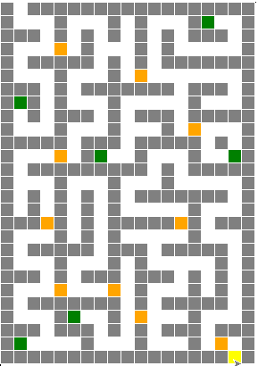

# Lancelot au Château du Python des Neiges

Jeu de quête dans le château au sommet du Python des Neiges.

- Langage utilisé : Python

- Modules utilisés : turtle

## Phase 1 : Création de la carte du jeu avec le module turtle de Python

